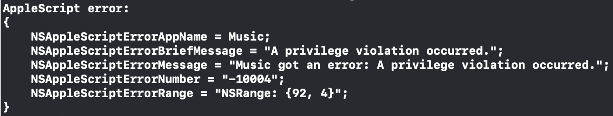
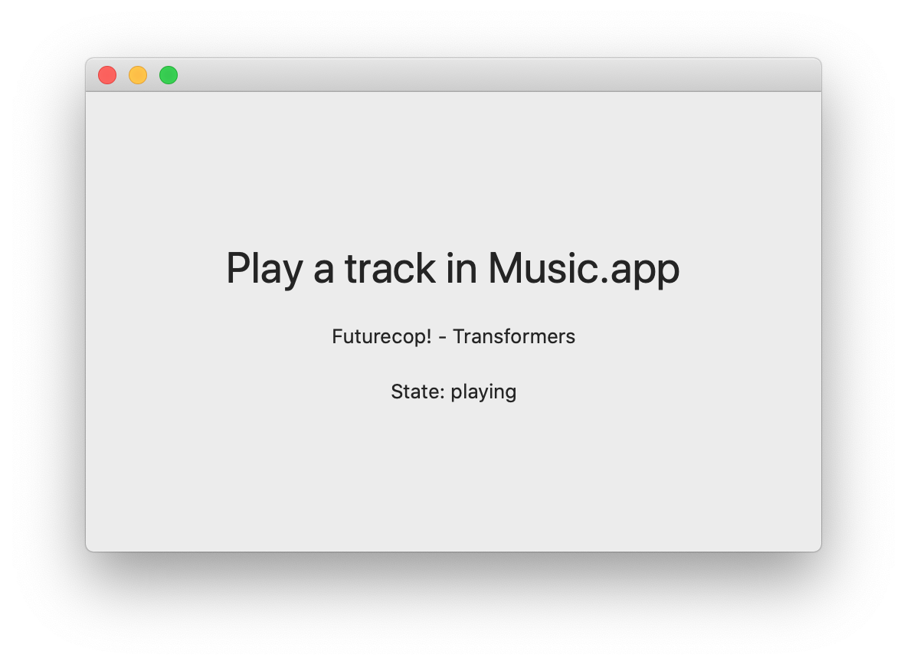

# Music.app Permission Issue

Shows an issue that prevents apps from accessing player info using AppleScript when sandboxing is enabled.

## Introduction

While Music.app uses a scripting interface very similar to iTunes, security scopes aren't handled the same or have a bug. The following entitlements allow iTunes to fetch the track info without issue. With Music.app an error is shown.

```
<key>com.apple.security.scripting-targets</key>
<dict>
	<key>com.apple.Music</key>
	<array>
		<string>com.apple.iTunes.playback</string>
		<string>com.apple.iTunes.library.read</string>
	</array>
</dict>
```

Only library information (`com.apple.iTunes.library.read`) seems to be affected. Fetching track artwork for instance works as expected.

## Setup

1. Launch Music.app.
2. Run the project.

## Steps to reproduce

1. Access a song on Apple Music, load a local track or skip a track.
2. Grant permission to CatalinaMusicBridge.app to access Music.app.

Notice the error that appears in the Console:


Also note that the player state _did_ update appropriately.

3. Disable sandboxing in `CatalinaMusicBridge.entitlements`.

```
<key>com.apple.security.app-sandbox</key>
<false/>
```

4. Run the project again.
5. Skip a track in Music.app.

Notice that the track information gets properly displayed:

